<picture>
  <source media="(prefers-color-scheme: dark)" srcset="assets/berlin-night.svg">
  <source media="(prefers-color-scheme: light)" srcset="assets/berlin-day.svg">
  
</picture>

  <a href="https://navidabdi.github.io/navidabdi/"><b>&#9654;&nbsp; Walk down the street in 3D</b></a>
  &nbsp;&middot;&nbsp; drag to orbit, rebuild it with the sliders

## Hi, I'm Nabi

Independent software engineer. I build for the web — mostly PHP and WordPress, with
JavaScript and React where they earn their place. Nine years on GitHub, and most of what
I ship lives behind a client login, so the street above counts the work rather than
showing it: one building per year, height set by contributions.

- **[webkima](https://webkima.com)** — my studio. WordPress engineering, custom blocks,
  performance work, and the occasional full rebuild.
- **nabimakes** — a workshop journal in progress: projects, model kits, and the files to
  make them. Built as a WordPress block theme, because of course it is.
- **Open source** — block editor starters and teaching material, mostly for people
  finding their way into Gutenberg.

Happy to talk about block theme architecture, getting real performance out of WordPress,
or why your build step is slower than it needs to be.

### Tools I reach for

&nbsp;&nbsp;
&nbsp;&nbsp;
&nbsp;&nbsp;
&nbsp;&nbsp;
&nbsp;&nbsp;
&nbsp;&nbsp;
&nbsp;&nbsp;
&nbsp;&nbsp;
&nbsp;&nbsp;
&nbsp;&nbsp;
&nbsp;&nbsp;
&nbsp;&nbsp;
&nbsp;&nbsp;
&nbsp;&nbsp;
&nbsp;&nbsp;

### Elsewhere

[webkima.com](https://webkima.com) · [LinkedIn](https://linkedin.com/in/nabiabdi) · [Instagram](https://instagram.com/nabiabdii)

---

The header is one SVG, redrawn every Monday by [a GitHub Action](.github/workflows/profile.yml)
from live API data — no third-party image services, no secrets, nothing that can rate-limit
it. Ten buildings, one per year. The Ampelmännchen is my status light, the Litfaßsäule
carries the view count, and the M10 runs on rails set into the asphalt. It animates once on
load and then holds still, and stops entirely if you've asked for reduced motion.

<!-- GitHub has no profile-view API. This badge is what actually counts a visit; the
     workflow reads its number back out and prints it on the Litfaßsäule above. -->

